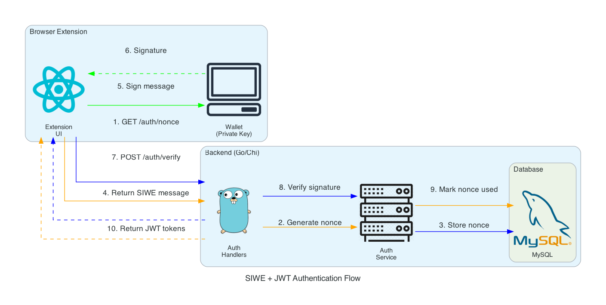

# AUTHENTICATION (SIWE + JWT)

Users prove wallet ownership by signing a message, then receive JWT tokens for API access.

## Flow Diagram



**Steps:**
1. Extension requests nonce from backend
2. Backend generates random nonce
3. Nonce stored in database (expires in 10 min)
4. Backend returns SIWE message to sign
5. Extension signs message with wallet's private key
6. Signature returned to extension
7. Extension sends message + signature to backend
8. Backend verifies cryptographic signature
9. Nonce marked as used (prevents replay)
10. JWT tokens returned to extension

## Endpoints

| Method | Endpoint | Auth | Description |
|--------|----------|------|-------------|
| `GET` | `/api/auth/nonce?wallet_address=0x...` | No | Get nonce and SIWE message |
| `POST` | `/api/auth/verify` | No | Verify signature, get tokens |
| `POST` | `/api/auth/refresh` | No | Refresh access token |
| `GET` | `/api/auth/me` | Yes | Get current user |
| `POST` | `/api/auth/logout` | Yes | Logout |

## Protected Routes

Require `Authorization: Bearer <access_token>`:

- `/api/favorites/*`
- `/api/policies/*`
- `/api/ai/*`
- `/api/simulate/*`
- `/api/settings/*`

## Token Response

```json
{
  "access_token": "eyJ...",
  "refresh_token": "eyJ...",
  "expires_in": 900,
  "token_type": "Bearer"
}
```

## Configuration

```env
JWT_SECRET=your-32-char-minimum-secret-key
JWT_ACCESS_TTL=15m
JWT_REFRESH_TTL=168h
AUTH_NONCE_TTL=10m
AUTH_DOMAIN=localhost
```

## Example

```bash
# 1. Get nonce
curl "http://localhost:8000/api/auth/nonce?wallet_address=0x742d..."

# 2. Sign message with wallet, then verify
curl -X POST "http://localhost:8000/api/auth/verify" \
  -H "Content-Type: application/json" \
  -d '{"message": "...", "signature": "0x..."}'

# 3. Use token for protected routes
curl "http://localhost:8000/api/favorites" \
  -H "Authorization: Bearer eyJ..."
```

## Extension Integration

The extension auto-authenticates when the wallet is unlocked:

1. User unlocks wallet → `App.tsx` calls `authenticate()`
2. `AuthService` signs SIWE message with private key
3. Tokens stored in `chrome.storage.local`
4. `api.ts` auto-includes JWT in protected requests

---

*Diagram generated with [diagrams](https://diagrams.mingrammer.com/) - see `auth_diagram.py`*
